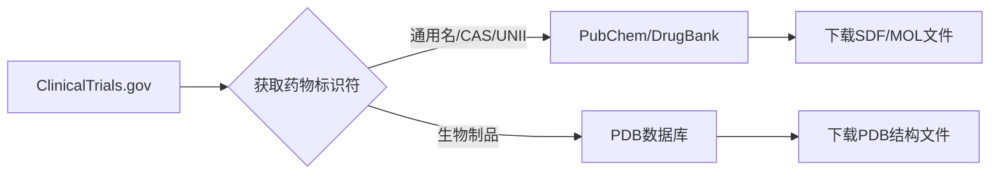

## Clinical Trial 


### 在 **ClinicalTrials.gov** 上 **无法直接查询药物的化学结构式**。这个平台的核心定位是**临床试验注册和结果数据库**，而非化学结构信息库。不过，您可以通过以下策略间接获取药物结构信息：

---

### 🔍 间接获取药物结构式的方案
#### 1. **提取关键标识符**
在临床试验页面获取以下关键信息：
- **药物通用名**（Generic Name）
- **CAS注册号**（CAS Registry Number）
- **UNII代码**（FDA唯一标识符）
- **NSC编号**（国家癌症研究所代码）

> 示例：在 [Pembrolizumab 试验页面](https://clinicaltrials.gov/ct2/show/NCT03114683) 的 "Interventions" 部分可找到：
> ```markdown
> Generic Name: Pembrolizumab
> UNII Code: DPT0O3T46P
> ```

#### 2. **跳转专业化学数据库**
将获取的标识符输入以下专业平台：

| 数据库 | 网址 | 支持标识符类型 |
|--------|------|----------------|
| **PubChem** | https://pubchem.ncbi.nlm.nih.gov | 通用名/CAS/UNII |
| **DrugBank** | https://go.drugbank.com | 通用名/UNII |
| **ChEMBL** | https://www.ebi.ac.uk/chembl | NSC/CAS |
| **ChemSpider** | http://www.chemspider.com | CAS/通用名 |

> 例如：在PubChem搜索 `DPT0O3T46P` → 直达 [Pembrolizumab结构式页面](https://pubchem.ncbi.nlm.nih.gov/compound/Pembrolizumab)

---

### 📌 ClinicalTrials.gov 中与药物结构相关的字段
虽然不直接提供结构式，但这些字段是获取结构的关键跳板：
```python
# 通过API获取药物标识符的示例
import requests

api_url = "https://clinicaltrials.gov/api/query/study_fields"
params = {
    "expr": "NCT03114683",  # 试验编号
    "fields": "InterventionName,InterventionOtherName",  # 关键字段
    "fmt": "json"
}

response = requests.get(api_url, params=params)
data = response.json()

# 提取药物标识信息
drug_identifiers = data["StudyFieldsResponse"]["StudyFields"][0]["InterventionOtherName"]
print(f"药物标识: {drug_identifiers}")
# 输出示例: ['DPT0O3T46P (UNII)', 'Keytruda (Brand Name)']
```

---

### 💊 直接获取结构式的专业方案
#### 1. **PubChem 批量下载**
```python
import requests

# 通过UNII代码获取结构式
unii = "DPT0O3T46P"
pubchem_url = f"https://pubchem.ncbi.nlm.nih.gov/rest/pug/compound/UNII/{unii}/SDF?record_type=3d"

response = requests.get(pubchem_url)
with open("pembrolizumab_3d.sdf", "wb") as f:
    f.write(response.content)  # 保存3D结构文件
```

#### 2. **DrugBank API**（需注册）
```python
import requests

drugbank_id = "DB09037"  # Pembrolizumab的DrugBank ID
headers = {"Authorization": "YOUR_API_KEY"}

response = requests.get(
    f"https://go.drugbank.com/structures/small_molecule_drugs/{drugbank_id}.sdf",
    headers=headers
)
```

---

### ⚠️ 重要注意事项
1. **生物制品限制**  
   单抗/疫苗等生物药通常**没有传统化学结构式**，需查询：
   - PDB蛋白质数据库（https://www.rcsb.org）
   > 示例：Pembrolizumab的PDB代码 [5DK3](https://www.rcsb.org/structure/5DK3)

2. **保密新药**  
   Phase I试验中的新分子可能：
   - 只有代号（如 "ABX-203"）
   - 结构式未公开
   - 需等论文发表或专利公开

3. **组合药物**  
   复方制剂（如抗HIV鸡尾酒疗法）需分别查询各组分

---

### 📊 推荐工作流


---

### 💡 实用技巧
1. **浏览器扩展辅助**  
   安装 [ChemAddict](https://www.chemaddict.com/) 插件，在ClinicalTrials.gov页面自动显示药物结构式

2. **专利逆向查询**  
   通过试验页面的 "References" 链接到相关专利（如USPTO），专利中常包含结构式

3. **EMA/FDA文件**  
   在 "Results References" 查找监管机构评估报告（含化学附录）

虽然ClinicalTrials.gov不直接提供结构式，但作为**临床试验信息枢纽**，它提供了连接化学数据库的关键桥梁。建议搭配专业化学工具实现高效检索！
